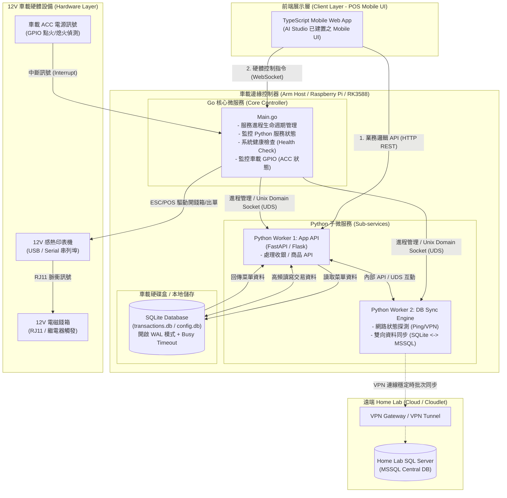

# Product Requirement Document (PRD)
專案名稱：小蜜蜂車載行動收銀系統 (Bee POS System) - 微服務架構
---
結合計程車的移動端系統、工地小蜜蜂的餐車模式，製成這種基於移動便利的餐車系統

## 1. 系統概述 (Executive Summary)
本專案旨在將已開發完成的手機端 TypeScript Web POS 前端，對接一套專為車載環境（低功耗、12V直供、離線優先）設計的後端微服務架構。
系統核心採用 **Go Language (Main.go)** 作為微服務排程器與硬體/行程控制器，驅動兩個獨立的 **Python 服務**：
1. **Python App API Worker**：負責處理前端傳入的業務邏輯、訂單計算與本地 SQLite 讀寫。
2. **Python DB Sync Worker**：負責監控網路連線（VPN/4G），實現本地 SQLite 與遠端 Home Lab Server的 MSSQL Server 雙向離線同步。
3. **Core Go API(Main.g)**:使用`start.sh`建立systemd的`*.service`直接掛接成系統服務，確保各項服務穩定運行

### 1.1 核心分工與技術棧 (Tech Stack)
1. **前端 (Frontend)**: 
  - 檔案放置於[Mobile](/Mobile/)。
  - TypeScript + Modern Web (既有 UI，適應手機端智慧型螢幕/全螢幕 Kiosk，Mobile-First)
2. **核心控制層 (Core Control / Service Orchestrator)**: **Go (`Main.go`)**:
  - 檔案放置於
  - 負責暴露 REST/WebSocket API 給前端。
  - 擔任服務調度核心，管理與驅動 Python 微服務進程。
  - 負責離線狀態監測、工作佇列與心跳機制 (Heartbeat)。
3. **業務邏輯與硬體控制微服務 (Business & Hardware Service)**: **Python (`app_backend.py`)**:
  - 檔案放置於
  - 處理結帳計算、單價邏輯、菜單管理。
  - 透過 USB/Serial 控制 12V 感熱印表機與 RJ11 電磁錢箱 (ESC/POS 指令)。
4. **資料庫與同步微服務 (Database & Sync Service)**: **Python (`app_db_sync.py`)**
  - 管理本地 **SQLite** 資料庫 (讀寫交易、訂單、菜單檔)。
  - 包含背景同步引擎 (Sync Engine)：監測 VPN/Home Lab 連線，將未同步資料寫入遠端 **MSSQL**。

---

## 2. 系統架構圖 (System Topology)




---

## 3. 模組詳細規格 (Module Specifications)

### 3.1 Go 核心控制層 (`Main.go`)
- **角色**: API Gateway & 微服務控制器。
- **職責**:
  1. **進程管理**: 開機時自動啟動並監控 `app_backend.py` 與 `app_db_sync.py` 子進程 (Subprocess Lifecycle)。
  2. **路由轉發**: 接收 TypeScript 前端發出的 HTTP/WebSocket 請求，分發至對應的 Python 微服務。
  3. **離線與連線狀態檢測**: 定期 Ping 遠端 Home Lab VPN IP，維護系統全域連線狀態 (`IS_ONLINE`) 並推播給前端。
  4. **快取與佇列**: 若 Python DB 服務暫時無回應，Go 負責記憶體內度的 Request 重試佇列。

### 3.2 Python 業務與硬體微服務 (`app_backend.py`)
- **角色**: 業務邏輯計算與 POS 硬體觸發器。
- **職責**:
  1. **結帳邏輯**: 計算實收、應找零金額驗證，格式化交易資料。
  2. **ESC/POS 硬體驅動**: 
     - 透過 `python-escpos` 或 `pyserial` 連接車載 12V 感熱印表機。
     - 發送特定 Pulse 指令 (`\x1b\x70\x00\x19\xfa`) 經由印表機 DK Port 觸發 12V 錢箱彈開。
  3. 提供 REST API (如 FastAPI/Flask) 供 `Main.go` 調用。

### 3.3 Python 資料庫與 MSSQL 同步微服務 (`app_db_sync.py`)
- **角色**: 本地 SQLite 資料持久化 & 遠端 MSSQL 非同步同步器。
- **SQLite 設置**:
  - 開啟 `PRAGMA journal_mode=WAL;` (防止車載異常斷電造成 DB 損毀)。
  - **資料表結構**:
    - `orders`: `order_id` (UUIDv4), `total_amount`, `cash_received`, `change_given`, `created_at` (ISO8601), `is_synced` (INTEGER: 0/1), `synced_at` (Timestamp).
    - `order_items`: `id`, `order_id`, `item_id`, `item_name`, `unit_price`, `quantity`, `subtotal`.
    - `items`: `item_id`, `name`, `price`, `category`, `is_active`.
- **MSSQL 同步引擎 (Sync Engine)**:
  - 運行背景 asyncio Task / Thread，每隔 30 秒檢測一次 VPN 連線狀況。
  - 當網路連通且遠端 Home Lab MSSQL 可連線時：
    1. 撈取 SQLite 中 `is_synced = 0` 的交易紀錄。
    2. 使用 `pyodbc` 或 `pymssql` 將資料批次寫入 (Batch Upsert) 遠端 MSSQL。
    3. 收到 MSSQL 寫入成功 ACK 後，更新本地 SQLite `is_synced = 1` 與 `synced_at` 時間。
  - 斷線時靜默失敗 (Fail-safe)，不阻斷本地任何結帳流程。

---

## 4. API 介面規格舉例 (Inter-Service API Contracts)

### 4.1 前端 ➔ Go (`Main.go`) API舉例
* **以下為舉例，不要使用這種格式**
1. `POST /api/v1/checkout`
   - **Request Body**:
     ```json
     {
       "items": [
         {"item_id": "A01", "name": "紅茶", "unit_price": 30, "quantity": 2}
       ],
       "total_amount": 60,
       "cash_received": 100
     }
     ```
   - **Response**:
     ```json
     {
       "status": "success",
       "order_id": "uuid-v4-string",
       "change_given": 40,
       "timestamp": "2026-09-18T13:48:00Z"
     }
     ```

2. `GET /api/v1/sync/status`
   - **Response**:
     ```json
     {
       "is_vpn_connected": true,
       "pending_sync_count": 5,
       "last_synced_at": "2026-09-18T12:00:00Z"
     }
     ```

3. `POST /api/v1/sync/trigger` (手動觸發同步)

---

## 5. 開發與部署要求 (Development & Non-Functional Requirements)

1. **車載斷電防護**:
   - Python 寫入 SQLite 必須確保 Transaction 完整性，使用 `WAL` 模式。
2. **通訊協定與資料格式**:
   - 微服務間統一採用 HTTP/JSON 或 lightweight gRPC 通訊。
   - 所有時間欄位一律使用 ISO8601 標準字串 (包含 UTC 時區)。
3. **錯誤處理 (Error Handling)**:
   - 硬體離線 (如印表機沒紙或未插線) 時，不可導致 Go 微服務崩潰，需傳回警告碼 `HARDWARE_OFFLINE`，但交易仍需寫入 SQLite。
4. **語言與註解**:
   - 程式碼註解與系統提示訊息請統一使用**繁體中文 (Traditional Chinese)**。

---

## 6. 系統非功能需求與範圍外 (Out of Scope)
- **不需要**：信用卡/第三方支付 API 串接（本版專注於現金）。
- **不需要**：複雜多門市/權限管理（專注於單車/單業主營運）。
- **不需要**：自動雲端庫存扣減運算（僅紀錄銷售紀錄與交易明細）。