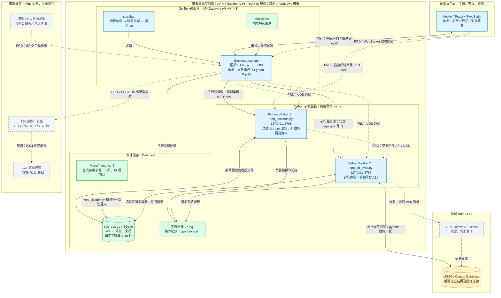
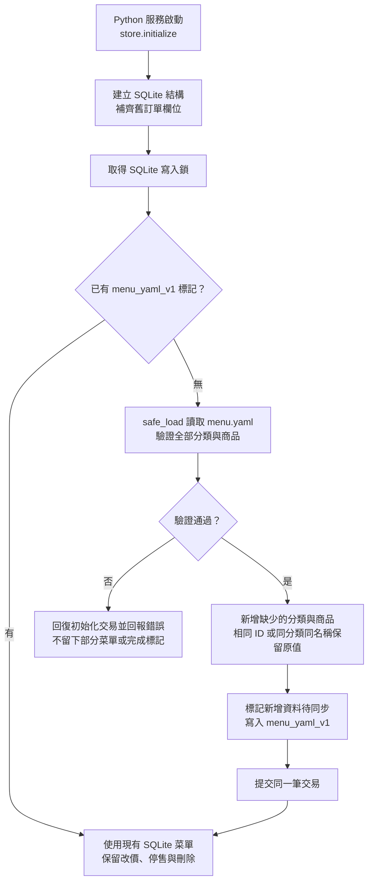
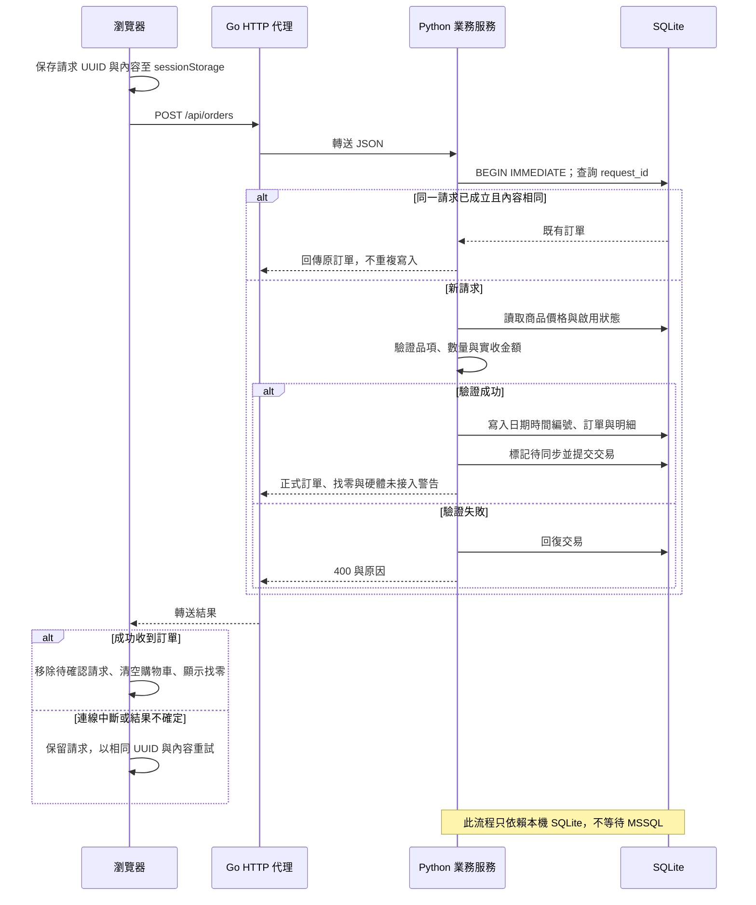

# Bee POS 小蜜蜂行動收銀系統

Bee POS 是供單車餐車與行動攤販使用的現金收銀系統。React／TypeScript 前端透過區域網路連到 Go 主機，由兩個專案 Venv Python 服務處理 SQLite 業務資料與 MSSQL 同步。

離線優先的範圍是「主機無法連到 MSSQL 或外網時，仍可使用本機 SQLite 收銀」。手機仍須連到本機主機，並不支援手機完全離線後獨立結帳。

## 功能與架構

| 區塊 | 目前功能 |
| --- | --- |
| 收銀 | 菜單點餐、自訂無碼品項、現金驗證、找零、交易重送去重 |
| 訂單 | 日期時間編號、建立／修改時間、狀態篩選、訂單明細與作廢 |
| 商品 | 新增、修改、啟用／停售、常用設定、軟刪除 |
| 日結 | 臺灣當日有效訂單統計、實際現金盤點與差額 |
| 資料匯出 | 已載入訂單的 CSV 與 JSON，不包含完整資料庫 |
| 介面 | 深／淺色主題、畫面 PIN 鎖定、每 10 秒重新讀取資料與同步狀態 |
| 同步 | 本機異動上傳與遠端資料下載程式、背景排程及手動同步入口；目前已知問題見文末 |

### 系統架構圖（依 PRD 分層，對照目前實作）

以下以 [PRD 的系統架構圖](Agent/PRD.md#2-系統架構圖-system-topology) 為主，保留前端展示層、車載邊緣控制器、Go 核心、Python 子服務、本地儲存、車載硬體與 Home Lab 分層，並補上現行網站入口、菜單初始化及紀錄檔。ACC／GPIO、UDS、WebSocket、VPN 與硬體控制依 PRD 列為規劃；不代表程式已提供這些能力。

目前以 Windows 主機模擬 ARM 車載主機。瀏覽器統一連到 Go，Go 再代理至只監聽 loopback 的 Python 服務。圖中實線為目前程式中的啟動、代理或資料流，虛線為 PRD 尚未實作的連線；灰色節點為尚未接入的設備或通道。



PRD 的瀏覽器直連業務服務、WebSocket 硬體通道及 UDS 尚未啟用；部署目前版本時只需讓用戶端連到 Go，不需對區網開放 Python 內部連接埠。兩個 Python 服務共用 SQLite，目前沒有彼此直接呼叫的內部 API。PRD 圖將印表機控制放在 Go，模組文字也描述 Python 的硬體職責；目前兩端皆未實作驅動，本圖沿用 PRD 圖的規劃方向。

同步 HTTP 路徑雖已有 Go 代理設定，目前處理器仍有參數不一致問題，詳見[目前限制與已知問題](#目前限制與已知問題)。圖中的 MSSQL 連線代表同步程式的目標，並不表示環境已連線或完成實機驗證。

正常收銀的資料路徑是「瀏覽器 → Go → Python 業務服務 → SQLite」，不等待 MSSQL。同步服務另外處理本機與遠端的資料交換；YAML 只在尚未完成菜單初始化時匯入，後續以 SQLite 為準。

### 與 PRD 的實作對照

| PRD 規劃 | 目前程式碼 |
| --- | --- |
| ARM 車載控制器與 systemd | Windows `start.bat` 啟動 Go；ARM、`start.sh` 與 systemd 尚未驗證／實作 |
| Go 調度兩個 Python 服務 | 已實作子行程管理，退出後等待 3 秒重啟；未實作卡死偵測 |
| REST／WebSocket 通訊 | 目前使用 HTTP／JSON；前端每 10 秒輪詢，未實作 WebSocket |
| 前端直接呼叫 Python 業務 API | 目前全部經 Go 同源代理，Python 只監聽 `127.0.0.1` |
| Go／Python 與 Python 服務間 UDS | Go 透過作業系統子行程管理與 loopback HTTP 代理；未實作 Unix Domain Socket 或 Python 間直接通訊 |
| FastAPI／Flask 業務服務 | 目前使用標準函式庫 `ThreadingHTTPServer` 與共用 HTTP 處理器 |
| 多個本機 DB 與 `is_synced` | 目前為單一 `bee_pos.db`；以 `sync_state.dirty`、版本與同步時間追蹤異動 |
| SQLite WAL 與 Busy Timeout | 已使用 WAL，`sqlite3.connect(timeout=10)` 設定最多 10 秒鎖定等待，並啟用外鍵與 `synchronous=FULL` |
| VPN／網路狀態偵測 | 目前直接依 ODBC 連線字串嘗試 MSSQL 同步，未控制 VPN 或偵測 SSID |
| ESC/POS、印表機與錢箱 | 僅保留 API；結帳回傳 `HARDWARE_OFFLINE`，仍儲存本機交易 |
| ACC 電源訊號與 GPIO 中斷 | 未實作點火／熄火偵測、GPIO 監控或車載電源控制 |
| 第三方支付 | 僅保留 API，目前只支援現金結帳 |

Go 使用標準函式庫管理 Python 行程與 HTTP 代理；子行程結束後等待 3 秒重啟。Python HTTP 服務使用標準函式庫 `ThreadingHTTPServer`，菜單解析使用 PyYAML，遠端資料庫使用選用的 pyodbc。前端使用 React 19、TypeScript、Vite、Tailwind CSS 與 Lucide 圖示。

## 專案目錄

```text
BeePOS/
├─ start.bat                  Windows 建置與啟動入口
├─ README.md
├─ .venv/                     專案 Python 虛擬環境，需自行建立
├─ Backend/
│  ├─ main.go、go.mod         Go 主機與服務行程管理
│  ├─ app_backend.py          業務 API 路由
│  ├─ http_worker.py          共用 JSON HTTP 處理器
│  ├─ requirements.txt        本機 Python 依賴
│  ├─ test_backend.py         業務、初始化、遷移與同步替身測試
│  └─ smoke_test.py           Go／Python HTTP 整合測試
├─ Database/
│  ├─ store.py                SQLite 交易與業務查詢
│  ├─ schema.sql              SQLite 結構
│  ├─ menu_loader.py          YAML 驗證與一次性初始化
│  ├─ Menu/menu.yaml          初始分類與商品
│  ├─ app_db_sync.py          MSSQL 同步服務
│  ├─ mssql_schema.sql        MSSQL 初始化／欄位升級腳本
│  └─ requirements.txt        PyYAML 與 pyodbc
├─ Mobile/
│  ├─ src/App.tsx             前端狀態與 API 串接
│  ├─ src/components/         收銀、訂單、商品、同步及鎖定介面
│  ├─ src/services/           HTTP 呼叫、介面偏好與匯出快取
│  ├─ src/types.ts            前端資料型別
│  ├─ package.json、package-lock.json
│  ├─ vite.config.ts、tsconfig.json
│  └─ dist/                   Vite 建置產物
└─ Agent/
   ├─ agent.md                開發計畫
   ├─ PRD.md                  系統需求
   └─ History.md              歷次開發與驗證紀錄
```

## Windows 安裝與啟動

以下命令以專案根目錄為起點，使用 PowerShell。準備 Go 1.22 以上、Node.js 22.12 以上與 Python 3.12。Node.js 版本須符合目前 Vite React 外掛的需求；Python 服務固定使用專案 `.venv`，不使用全域套件環境。

```powershell
# 首次設定
py -3.12 -m venv .venv
.\.venv\Scripts\python.exe -m pip install -r Backend/requirements.txt
npm.cmd --prefix Mobile ci

# 建置並啟動
.\start.bat
```

已有可用的 `.venv` 時不必重建。虛擬環境依賴建立時的基底 Python，搬移到其他電腦或移除基底直譯器後應重新建立，不要直接複製使用。

`start.bat` 依序檢查 Go、Node.js、Venv、PyYAML 與前端依賴目錄，再執行 Vite 建置、編譯 `Backend/beepos.exe`，最後啟動 Go。它不會自動安裝套件，也不會修改防火牆。

- 本機開啟 `http://localhost:8080`。
- 同一區網裝置開啟 `http://主機內部IP:8080`，Windows 私人網路防火牆需允許對應連接埠。
- 使用 Ctrl+C 停止主機；Windows 會透過 `taskkill` 結束 Python 子行程樹。
- Go 顯示已啟動時，Python 仍可能正在初始化；可使用 `/api/health` 確認本機資料服務是否就緒。

目前提供 Windows 啟動與整合測試流程。Go 雖包含 `.venv/bin/python` 路徑備援，仍未提供 Linux systemd、`start.sh` 或 ARM 部署驗證。

## 前端開發

先在第一個終端機執行 `start.bat`，再於第二個終端機執行：

```powershell
npm.cmd --prefix Mobile run dev
```

開發網站預設位於 `http://localhost:3000`，Vite 將 `/api` 代理到 `http://127.0.0.1:8080`。若變更 Go 對外連接埠，開發代理目標也須配合調整；`BEE_PORT` 不會自動改變 Vite 設定。

`npm run lint` 執行 TypeScript 型別檢查，`npm run build` 產生 `Mobile/dist`。`npm run preview` 只有 Vite 靜態預覽，不是包含 Python 與 API 代理的完整主機。`DISABLE_HMR=true` 會停用 Vite 熱更新與檔案監看。

## 菜單初始化

`Database/Menu/menu.yaml` 目前包含便當主食、經典小吃、冷飲湯品，共 14 項商品。結構如下：

```yaml
version: 1
categories:
  - name: 便當主食
    products:
      - id: p1
        name: 招牌排骨便當
        price: 100
        is_active: true
        is_favorite: true
```

商品 ID 必須唯一，價格為非負整數，啟用與常用欄位必須是布林值。解析使用 `yaml.safe_load`，整份資料通過驗證後才以單一 SQLite 交易寫入。

首次初始化會新增缺少的分類與商品並標記待同步；已有相同 ID 或同分類／名稱的商品保留原值，其他既有商品也不刪除。完成後在 `initialization_state` 寫入 `menu_yaml_v1` 標記，之後重啟不會覆蓋改價、停售或刪除結果。

YAML 是初始資料來源，初始化後以 SQLite 為準。後續請透過商品頁管理菜單；修改 YAML 不會自動更新已初始化的資料庫，目前沒有重新匯入按鈕。瀏覽器舊版範例資料不會自動匯入。

### 初始化流程



兩個 Python 服務皆會呼叫初始化；寫入鎖與完成標記避免同時啟動造成重複匯入。

## 訂單與本機資料規則

新訂單編號由主機依臺灣時間產生，例如 `20260921-023420-123456`，格式為 `YYYYMMDD-HHmmss-ffffff`，最後六位為微秒。SQLite 寫入鎖內若遇到相同編號便遞增微秒。修改訂單不改編號，另外更新 `updated_at`；建立與修改時間保存為 UTC ISO8601，介面以臺灣時間顯示。不另建立每筆訂單檔案。

結帳請求的 `id` 是前端產生的 UUID，用於防止重送產生重複交易，與後端回傳的日期時間訂單 `id` 不同。同一請求 ID 與相同內容會回傳原訂單；同一 ID 搭配不同內容會被拒絕。

後端依商品目前價格計算金額，前端價格過期、商品停售、數量無效或實收不足時拒絕結帳。金額使用整數新臺幣，每單接受 1～100 個品項、每個品項數量 1～999。成交名稱與單價保留於明細，商品後續修改不影響歷史訂單。

前端在送出結帳時將待確認交易保留於原分頁的 `sessionStorage`，成功回應後才清空購物車；連線或回應不確定時可使用相同請求重試。這不是完整購物車持久化，也不保證關閉分頁後恢復。

SQLite 使用 WAL、外鍵與 `synchronous=FULL`，每個連線的鎖定等待上限為 10 秒。主要資料表為 `categories`、`products`、`orders`、`order_items`、`settlements`，另以 `sync_state`、`sync_logs`、`initialization_state` 保存同步與初始化資訊。不建立 View；總額、小計、找零由 Python 計算。這些設定提供交易一致性與寫入保護，並不代表已驗證車載斷電或硬碟故障情境。

商品使用軟刪除，訂單使用作廢狀態，不提供訂單實體刪除 API。日結保存盤點日期、實際現金、備註與建立時間，應收及差額依臺灣當日有效訂單計算，尚未實作不可變的會計封帳。

訂單頁的當日統計僅計算臺灣當日已完成訂單，但列表目前依狀態篩選全部已載入訂單，不限當日。CSV／JSON 也匯出全部已載入訂單，不包含商品、日結或同步資料，不能當成完整 SQLite 備份。

### 現金結帳流程



同一請求 UUID 搭配不同內容會被拒絕；日期時間訂單主鍵由主機分配，不採用前端 UUID 作為正式訂單編號。

## MSSQL 設定與同步

本機收銀只需 `Backend/requirements.txt` 中的 PyYAML。使用 MSSQL 時，另安裝 Microsoft ODBC Driver 18 for SQL Server，並在同一個 Venv 安裝資料庫依賴：

```powershell
.\.venv\Scripts\python.exe -m pip install -r Database/requirements.txt
```

在專供 Bee POS 使用的 MSSQL 資料庫執行 `Database/mssql_schema.sql`，再設定連線字串。此腳本建立資料表，不會建立資料庫；Go／Python 啟動時也不會自動執行遠端結構腳本。

```powershell
$env:BEE_MSSQL_CONNECTION_STRING = 'DRIVER={ODBC Driver 18 for SQL Server};SERVER=伺服器位址;DATABASE=BeePOS;Trusted_Connection=yes;Encrypt=yes;TrustServerCertificate=no;'
.\start.bat
```

上述範例使用執行服務的 Windows 身分驗證，伺服器憑證需可驗證；也可依環境改用 SQL Server 帳號連線字串。程式讀取環境變數，不會自動載入 `.env`，無須 Gemini API 金鑰。

舊版 MSSQL 需重新執行結構腳本，補上 `orders.request_id`、`updated_at`。SQLite 啟動時自動補上這兩個欄位，保留舊訂單主鍵與明細；舊紀錄沒有修改時間時，以建立時間補值，畫面編號依建立時間呈現。

同步引擎先上傳本機待同步異動，依序處理分類、商品、訂單、明細與日結，再全表取回遠端資料。遠端提交成功後才比對本機版本並確認同步；傳送期間新增的修改仍保留待同步。本機待同步修改優先，沒有待同步修改的資料接受遠端版本。目前不支援多主機衝突合併或實體刪除傳播，遠端商品也應使用 `deleted=1`。

背景服務啟動後即嘗試同步，每輪結束後等待預設 30 秒；也提供手動同步入口。相同同步程序內以鎖避免並行執行，重疊要求回傳 409。狀態中的待同步筆數只計算訂單，不是全部異動數；最近連線狀態表示同步嘗試結果，不是即時 VPN 或網路探測。當前同步入口與例外處理的限制見文末。

## API 介面

以下為 Go 對外路由。請求與一般回應使用 JSON，寫入時提供 `Content-Type: application/json`，要求內容上限為 1 MiB。

| 方法 | 路徑 | 用途與主要內容 |
| --- | --- | --- |
| GET | `/api/health` | 檢查本機 SQLite 資料服務，不代表 MSSQL 可用 |
| GET | `/api/products` | 商品清單，不含已軟刪除商品 |
| POST | `/api/products` | 新增：`name`、`category`、`price`、`is_active`、`is_favorite` |
| PUT | `/api/products/{id}` | 以完整商品欄位更新商品 |
| DELETE | `/api/products/{id}` | 商品軟刪除 |
| GET | `/api/orders` | 全部訂單與明細，目前沒有分頁 |
| POST | `/api/orders` | 現金結帳；請求 ID 用於重送去重 |
| PATCH | `/api/orders/{id}` | 更新 `status`（`completed`／`cancelled`）與 `note`；省略備註會設為空字串 |
| POST | `/api/settlements` | 保存 `id`、`cash_actual`、`notes`，日期與統計由後端計算 |
| GET | `/api/sync/status` | 同步狀態及最近 30 筆紀錄；目前有路由參數問題 |
| POST | `/api/sync` | 手動觸發同步；目前有路由參數問題 |
| GET／POST／PUT／PATCH／DELETE | `/api/payments`、`/api/hardware`、`/api/vpn` | 保留路由，回傳 501 `NOT_IMPLEMENTED` |

結帳請求範例：

```json
{
  "id": "e40e9442-471f-4c3b-8848-9ef1358a9250",
  "received_amount": 200,
  "items": [
    {"product_id": "p1", "unit_price": 100, "quantity": 1},
    {"product_name": "自訂品項", "unit_price": 20, "quantity": 1}
  ]
}
```

自訂商品省略 `product_id` 並提供 `product_name`。`total_amount`、`change_amount` 由後端計算，不採用前端提供的總額。成功回應包含正式訂單 `id`、`order_no`、建立／修改時間、明細與同步狀態；目前亦回傳 `HARDWARE_OFFLINE`，表示未接入出單硬體，交易仍會保存。

一般驗證錯誤回傳 400，查無資料或路由回傳 404，服務錯誤回傳 503。Go 對帶有不符目前來源的 `Origin` 標頭要求回傳 403；此檢查不是使用者身分驗證。

## 環境設定

| 變數 | 預設值／用途 |
| --- | --- |
| `BEE_ROOT` | `start.bat` 在未指定時設為專案根目錄；直接執行 Go 時預設為工作目錄的上一層 |
| `BEE_HOST` | `0.0.0.0`，Go 對外監聽位址 |
| `BEE_PORT` | `8080`，Go 對外 HTTP 連接埠 |
| `BEE_APP_PORT` | `8765`，業務服務只監聽 `127.0.0.1` |
| `BEE_SYNC_PORT` | `8766`，同步服務只監聽 `127.0.0.1`，不可與業務服務相同 |
| `BEE_DB_PATH` | `Database/bee_pos.db`，SQLite 檔案路徑 |
| `BEE_STATIC_DIR` | `Mobile/dist`，Go 提供的靜態網站目錄，必須含 `index.html` |
| `BEE_SYNC_INTERVAL` | `30`，背景每輪完成後等待秒數，最少 5 秒 |
| `BEE_MSSQL_CONNECTION_STRING` | 無預設值，MSSQL ODBC 連線字串 |
| `DISABLE_HMR` | 未設定時啟用 Vite 熱更新；值為 `true` 時停用 |

路徑覆寫建議使用絕對路徑，避免 Go 啟動目錄與 Python 工作目錄不同造成混淆。程式固定從專案 `.venv` 尋找 Python，沒有 `BEE_PYTHON` 覆寫設定。

## 紀錄檔與檢查

| 檔案／資料 | 內容 |
| --- | --- |
| `Database/main.log` | Go 啟動錯誤與行程重啟紀錄 |
| `Database/app_backend.log` | 業務 API 系統紀錄 |
| `Database/app_db_sync.log` | 同步服務系統紀錄 |
| `Database/operations.txt` | 商品、結帳、訂單狀態、日結及菜單初始化操作紀錄 |
| SQLite `sync_logs` | 最多保留 100 筆同步結果，狀態 API 取最近 30 筆 |

一般紀錄檔尚無自動輪替。覆寫 `BEE_DB_PATH` 不會改變上述紀錄檔位置。

常見問題可依下列方式檢查：

| 現象 | 檢查項目 |
| --- | --- |
| 啟動時找不到 Venv 或 `yaml` | 建立 `.venv`，使用其 Python 安裝 `Backend/requirements.txt` |
| 缺少前端依賴或 `dist/index.html` | 執行 `npm.cmd --prefix Mobile ci`、`npm.cmd --prefix Mobile run build` |
| 主機無法啟動 | 查看終端機與 `main.log`，確認對外／內部連接埠未被占用 |
| 手機無法連線 | 使用主機內部 IP，確認同一區網、監聽位址與私人網路防火牆 |
| YAML 修改後菜單沒變 | 已完成一次性初始化；後續從商品頁修改 SQLite 資料 |
| 本機可結帳、同步回傳 400 | 先核對下述同步路由參數問題，不一定是 MSSQL 連線失敗 |

## 開發驗證

下列命令供開發時執行，會產生建置檔、Python 快取或測試紀錄，不是唯讀檢查。

```powershell
# 前端
npm.cmd --prefix Mobile run lint
.\Mobile\node_modules\.bin\tsc.cmd --project Mobile/tsconfig.json --noEmit --noUnusedLocals --noUnusedParameters
npm.cmd --prefix Mobile run build

# Python：目前定義 14 項測試
.\.venv\Scripts\python.exe -m unittest discover -s Backend -p 'test_*.py' -v

# Go 與 HTTP 整合測試
Push-Location Backend
go build -o beepos.exe .
go vet ./...
Pop-Location
.\.venv\Scripts\python.exe Backend/smoke_test.py
```

Python 測試使用暫存 SQLite，同步以替身模擬 ODBC 行為，無法取代真實 MSSQL 驗證。HTTP 整合測試啟動 `Backend/beepos.exe`、使用暫存資料庫與測試 HTML，結束時清理行程；它不是 React 瀏覽器視覺測試，也可能寫入專案系統紀錄檔。

## 目前限制與已知問題

- `Database/app_db_sync.py` 的 `dispatch` 目前只接受 `(method, path)`，但 `Backend/http_worker.py` 會傳入 `(method, path, data)`。依目前程式碼，同步狀態與手動同步 HTTP 入口會因 `TypeError` 回傳 400；直接呼叫背景同步函式不經此路由。既有測試仍有三參數呼叫，不能將歷史通過結果視為目前版本已全部通過。
- 同步服務目前只捕捉指定的 Python 例外種類，未全面涵蓋 pyodbc／SQLite 錯誤；未捕捉的錯誤可能中止背景同步執行緒，且不一定更新同步狀態。主機仍存活時，Go 不會因背景執行緒停止而重啟服務。
- 同步為全表下載，尚未實作大資料量分頁、多車衝突合併或刪除傳播。
- PIN 預設為 `8888`，只鎖定前端畫面；目前無 PIN 設定介面、後端帳號認證或 HTTPS 終端。本版以受信任區網營運為前提。
- 未實作 Wi-Fi SSID 偵測、VPN 通道、第三方支付、印表機／錢箱、ACC／GPIO 點火熄火偵測、UDS 通訊、WebSocket 推播、Go 請求重試佇列與卡死行程的健康重啟。

本文件於 2026-09-21 依目前程式碼核對更新。本次僅更新 README，未執行會產生檔案的建置、測試或服務啟動，也未修改上述已知問題。需求規劃與歷史驗證分別記錄於 `Agent/PRD.md`、`Agent/agent.md` 與 `Agent/History.md`；歷史紀錄不代表每次後續修改都已重新驗證。
